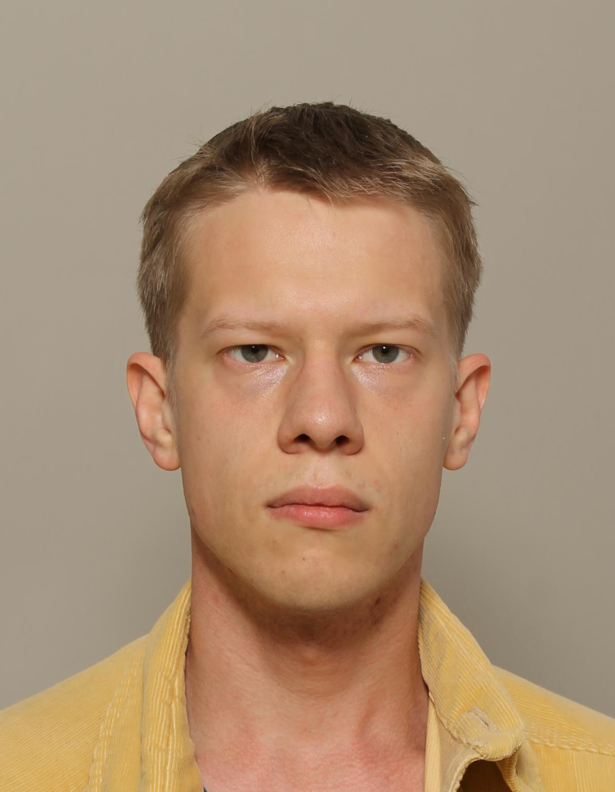
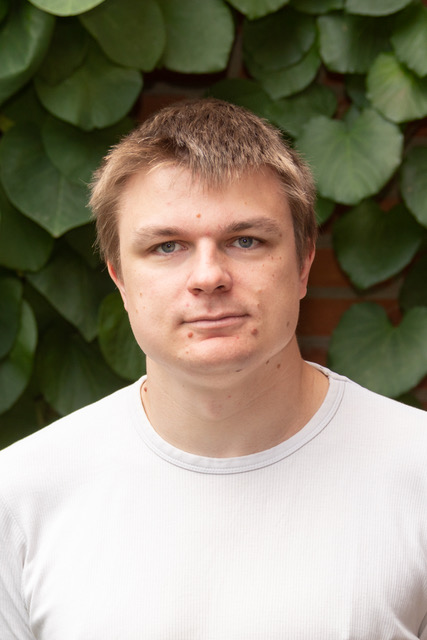

<h1>
 Your teachers 
</h1>
# Daniel Mikkola
 Daniel Mikkola started his PhD at Lund Observatory in 2017 under the supervision of Drs David Hobbs &  Paul J. McMillan. The title of his PhD is <i>Galactic Dynamics in the Gaia Era</i> and outlines his research intersets: studying and contextualising the movements of stars within the Milky Way Galaxy.

Daniel took over the Python programming course in 2018 from Brian Thorsbro and has been working with it ever since to ensure it provides the necessary skills for the students Lund Observatory to carry out their own computations and analyses.

His hobbies in his spare time include: Hiking, camping, fishing, board games, video games & baking bread.

<h1 style="margin-top:-0.3cm">Eero Vaher</h1>
Lorem ipsum dolor sit amet, consectetur adipiscing elit. Quisque sodales mi eget convallis lobortis. Nulla accumsan vehicula quam tristique dignissim. Vivamus ac elit laoreet enim sollicitudin dignissim. Nulla magna nisl, hendrerit et quam interdum, maximus varius quam. Phasellus a scelerisque velit, et scelerisque libero. Phasellus porta ex id velit suscipit dapibus.

Cras sagittis volutpat urna, sit amet viverra justo gravida sit amet. Suspendisse egestas tristique ex eget tristique. In dapibus risus dolor, luctus facilisis arcu congue ac. Nunc sit amet suscipit mi, ac egestas velit. Duis tincidunt condimentum magna id tristique. Nam volutpat mi ac ultrices congue. Aenean laoreet justo nec facilisis tincidunt. Aenean vitae placerat lacus, id lacinia magna. Vivamus porta, leo ac laoreet convallis, felis dui eleifend

<h1 style="margin-top:-0.3cm">Simon Alinder</h1>
Lorem ipsum dolor sit amet, consectetur adipiscing elit. Quisque sodales mi eget convallis lobortis. Nulla accumsan vehicula quam tristique dignissim. Vivamus ac elit laoreet enim sollicitudin dignissim. Nulla magna nisl, hendrerit et quam interdum, maximus varius quam. Phasellus a scelerisque velit, et scelerisque libero. Phasellus porta ex id velit suscipit dapibus.

Cras sagittis volutpat urna, sit amet viverra justo gravida sit amet. Suspendisse egestas tristique ex eget tristique. In dapibus risus dolor, luctus facilisis arcu congue ac. Nunc sit amet suscipit mi, ac egestas velit. Duis tincidunt condimentum magna id tristique. Nam volutpat mi ac ultrices congue. Aenean laoreet justo nec facilisis tincidunt. Aenean vitae placerat lacus, id lacinia magna. Vivamus porta, leo ac laoreet convallis, felis dui eleifend

